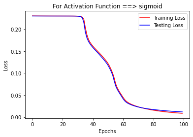
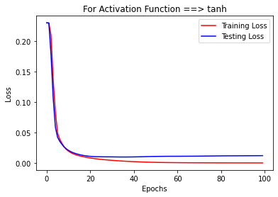
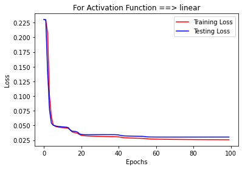
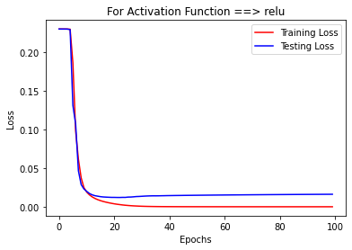
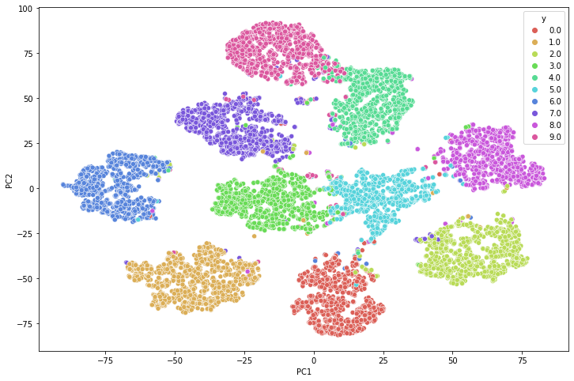
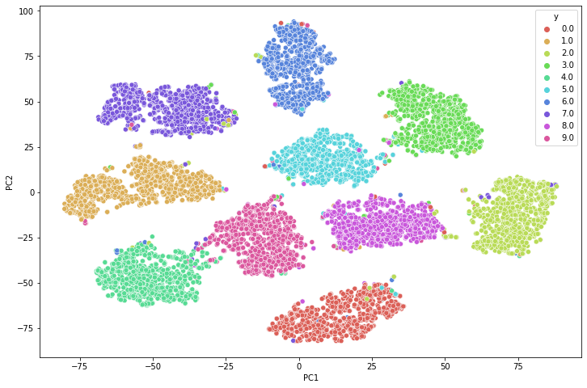
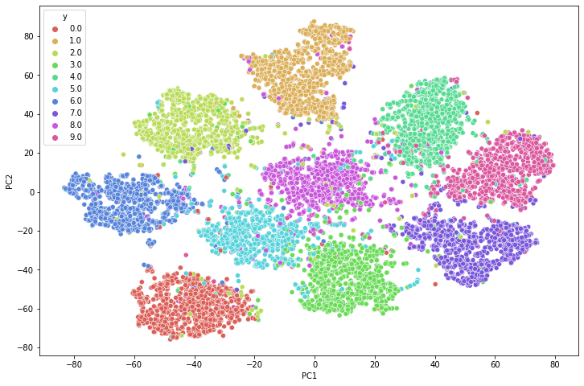
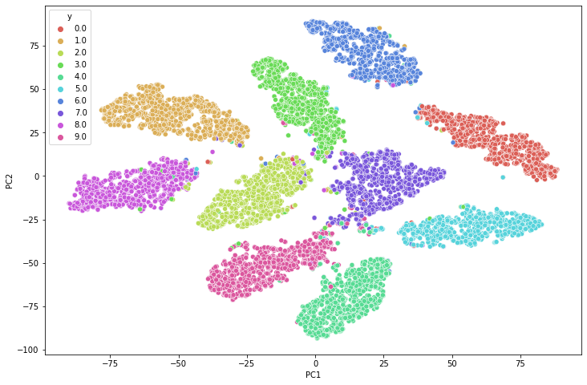

# Standard-NN-for-Digits-Classification
1. The projects explore the use of a neural network implemeneted from scratch using numpy only.
2. The neural nets made are used for classification on digits dataset.
3. A comparative report based on loss plots and accuracy obtained for various activation functions viz. sigmoid, tanh, linear, relu.
4. The output layer is softmax in all the cases and cross entropy loss.
5. The model is trained for 100 epochs.
5. T-SNE plots for the last layers are also prepared for all the activations.
6. The code is well commented and labelled wherever necessary.

## Description of Files
1. Main.ipynb &#8594; The notebook that presents and generate the results discussed below
2. NN.py &#8594; The files contains the Neural Network implemented from scratch using numpy only.

## Results
|Activation Function|Accuracy|
|-----------------|------------|
|Sigmoid|0.967|
|Tanh|**0.9757**|
|Linear|0.914|
|ReLU|0.9753|

### Loss Plots

Sigmoid|Tanh|
:-------:|:---:|
||

Linear| ReLU|
:-------:|:---:|
||

### T-SNE Plots

Sigmoid|Tanh|
:-------:|:---:|
||

Linear| ReLU|
:-------:|:---:|
||
